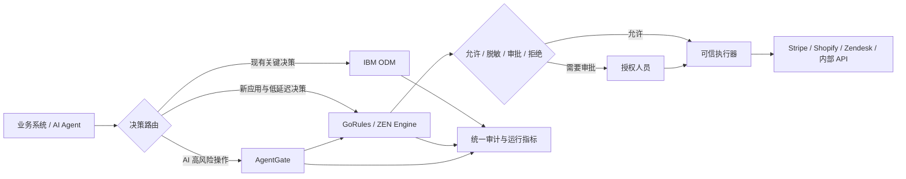

# 从 IBM ODM 到现代决策执行与 AI Agent 治理

## 给管理层的 30 秒版本

IBM ODM 已经承载了贵公司的关键决策，我们不建议用一次高风险项目把它全部替换掉。

我们建议保留已经稳定运行的 ODM 决策，同时用 **GoRules / ZEN Engine** 承接新的云原生、跨语言和 AI Agent 场景。规则可以直接嵌入应用运行，也可以通过统一平台完成编辑、测试、审批、发布和审计。

第一阶段只选择一个边界清晰的场景，例如客服退款审批。我们会在不影响现有生产流程的情况下并行计算 ODM 与 GoRules 的结果，验证一致性、响应时间、发布效率和运维工作量。只有数据证明收益后，才迁移下一批规则。

这不是一次“大爆炸式替换”，而是一条可衡量、可回退的现代化路径。

## 我们看到的现状

IBM ODM 在集中治理、复杂企业决策和大型系统集成方面非常成熟。随着数字业务和 AI Agent 增加，团队通常会遇到新的要求：

- 决策需要在 Node.js、Python、Go、Java、.NET 或移动端附近直接执行。
- 新规则需要以天或小时发布，而不是等待完整应用发布周期。
- 业务人员希望读懂规则，工程团队希望规则可以测试、版本化和回滚。
- AI Agent 在退款、付款、发送消息或修改数据前，需要确定性的许可判断。
- 敏感数据和决策请求不能离开客户自己的网络。
- 团队希望避免每增加一个决策场景，就增加一套长期运行的服务和调用成本。

ODM 仍可以继续保护成熟的核心决策。GoRules 用来解决新增需求，并逐步降低新系统对单一传统平台的依赖。

## 建议的目标架构

这个架构允许两套平台长期共存。每个决策根据风险、运行环境和迁移收益选择最合适的执行方式。

## 为什么选择 GoRules

| 客户需求 | GoRules 的应对方式 | 对现有 ODM 环境的影响 |
|---|---|---|
| 跨语言运行 | 同一 Rust 内核提供 Node.js、Python、Go、Java、Kotlin、.NET 和其他绑定 | 新应用不必全部围绕 JVM 或远程决策服务构建 |
| 低延迟和高可用 | 规则直接嵌入应用，无须每次通过网络调用中心服务 | 应用可以独立扩容，并减少新的运行依赖 |
| 业务与工程协作 | 可视化决策表、决策图和可读 Policy Document | 业务规则与可执行内容保持一致 |
| 变更治理 | 测试、版本、审批、发布环境、回滚和审计 | 可以沿用企业现有的职责分离流程 |
| 数据主权 | 可在客户 VPC、Kubernetes 或应用进程内执行 | 决策输入不必发送给外部 SaaS |
| AI Agent 控制 | 确定性规则位于模型与真实工具之间 | 模型不能自行决定是否有权执行高风险操作 |
| 采用风险 | 开源 ZEN Engine 使用 MIT License，规则保存为可移植 JSON | 可以从单个场景开始，不必先签署全平台替换计划 |

## IBM ODM 与 GoRules 的合理分工

| 继续留在 IBM ODM | 优先放到 GoRules / AgentGate |
|---|---|
| 已经稳定运行且变更较少的关键规则 | 新建的数字产品规则 |
| 与大型主机或现有 IBM 自动化平台深度集成的决策 | Node.js、Python、Go、移动端和边缘应用 |
| 依赖现有 ODM 专有资产、流程或专业团队的规则 | 需要直接嵌入、离线或低延迟执行的规则 |
| 当前没有明确迁移收益的规则 | AI Agent 的退款、付款、消息发送和数据修改 |
| 暂时无法建立完整回归测试的规则 | 可以通过输入输出测试证明等价性的规则 |

## 建议从“受控退款”开始

客服退款是一个适合验证价值的首个场景：

1. AI Agent 或客服系统提交退款请求。
2. 服务端补充订单余额、订单年龄、历史退款和风险标记等可信事实。
3. GoRules 判断自动允许、要求客服主管审批、要求财务/安全会签，或直接拒绝。
4. 审批结果生成与订单、金额、策略版本和有效期绑定的一次性授权。
5. 执行前重新检查当前余额和风险状态。
6. 可信执行器调用支付系统，并保存退款凭证和完整审计记录。

建议先连接支付测试环境，不触碰真实资金。现有 ODM 可以同时对同一批请求给出结果，作为对照基线。

## 4–6 周低风险试点

### 第一阶段：确定基线

- 选择一个拥有明确负责人、输入、输出和测试样本的决策。
- 导出或整理现有 ODM 规则、历史输入和预期结果。
- 记录当前发布周期、故障处理方式、运行成本和响应时间。

### 第二阶段：并行实现

- 在 GoRules 中重建同一决策。
- 建立边界值、异常输入和回归测试。
- 将 GoRules 接入测试环境，不改变生产流量。

### 第三阶段：影子运行

- 同一请求同时发送给 ODM 和 GoRules。
- ODM 继续提供正式生产结果。
- 自动比较两边输出，调查每一个差异。

### 第四阶段：受控切换

- 只将约定范围的流量切换到 GoRules。
- 保留快速回退到 ODM 的能力。
- 根据成功指标决定扩大、暂停或终止迁移。

## 试点成功指标

具体目标由双方在启动前填写，避免使用无法验证的营销承诺。

| 指标 | 当前基线 | 试点目标 | 验证方式 |
|---|---:|---:|---|
| ODM 与 GoRules 结果一致率 | 待测 | 约定值 | 历史样本与影子流量 |
| P95 决策响应时间 | 待测 | 约定值 | 相同运行环境压测 |
| 一次规则变更的交付时间 | 待测 | 约定值 | 从需求确认到可发布版本 |
| 回归测试覆盖率 | 待测 | 约定值 | 决策路径和边界测试 |
| 生产回退时间 | 待测 | 约定值 | 演练并记录结果 |
| 新场景基础设施成本 | 待测 | 约定值 | 使用客户自己的成本口径 |
| 人工审批率 | 待测 | 约定值 | 自动允许、人工审批和拒绝的比例 |

## 风险控制

- **不修改现有 ODM 生产决策。** 首个阶段只进行影子计算。
- **不承诺自动转换全部规则。** 每一组规则都通过测试证明等价性。
- **不让 AI 直接执行敏感操作。** AI 只能提出请求，策略层和可信执行器掌握最终权限。
- **不依赖单一切换点。** 流量按场景或比例迁移，并保留回退路径。
- **不使用未经测量的 ROI 数字。** 成本、延迟和交付效率全部来自客户自己的基线。
- **不要求先迁移所有治理流程。** 试点只复制完成安全验证所必需的审批与审计控制。

## 常见问题

### “我们已经为 IBM ODM 投入了很多，为什么还需要另一个平台？”

这项计划不是否定现有投入。ODM 继续承担已经证明稳定的核心决策。GoRules 首先服务于 ODM 当前没有覆盖、或使用 ODM 成本较高的新场景。客户只在实际数据证明收益后扩大范围。

### “两套平台会不会增加复杂度？”

试点确实会短期增加一个决策运行路径，所以范围必须小，并设置统一的指标、审计和负责人。目标是验证新的运行模型是否能够减少未来每个应用单独开发和维护规则的复杂度。没有净收益就不继续扩大。

### “GoRules 能否完整支持我们所有 ODM 规则？”

在分析现有规则资产前不能作出这个承诺。复杂推理、事件处理、专有扩展或深度 IBM 集成可能继续留在 ODM。试点会建立能力映射，把规则分成可以直接迁移、需要重构和不建议迁移三类。

### “如何满足审计和职责分离？”

规则变更经过版本、测试、审批和发布流程。对 AI Agent 操作，执行授权还会绑定准确请求、审批角色、策略版本和有效期，并记录执行结果。正式方案需要与客户的身份提供商、日志平台和保留策略集成。

### “如果试点失败怎么办？”

ODM 始终保留为正式决策路径。GoRules 可以从影子环境直接移除，不会影响现有生产规则。

## 建议的下一步

安排一个 90 分钟的决策现代化工作坊，邀请：

- ODM 平台负责人
- 目标业务流程负责人
- 应用架构师
- 风险或合规负责人
- 负责目标系统的工程负责人

工作坊只需要完成三个输出：

1. 选择一个试点决策。
2. 确认基线与成功指标。
3. 确认影子运行的数据、负责人和回退方案。

如果双方无法找到一个低风险、可测试且有明确收益假设的场景，就不启动试点。

## 会前发现问题

1. 当前哪些 ODM 决策变更最频繁？
2. 哪些新应用因为语言、部署或网络要求没有接入 ODM？
3. 一次规则变更从业务提出到生产发布通常需要多久？
4. 哪些决策必须离线、边缘或在应用进程内执行？
5. 当前如何测试规则覆盖率并重放历史决策？
6. 是否已经有 AI Agent 能够退款、付款、发送消息或修改客户数据？
7. 哪些操作需要多人审批，审批结果现在记录在哪里？
8. 客户最担心的是迁移风险、合规、供应商锁定、运行成本，还是团队技能？

## 参考资料

- [IBM Operational Decision Manager 产品说明](https://www.ibm.com/products/operational-decision-manager)
- [IBM Operational Decision Manager 部署与计价模式](https://www.ibm.com/products/operational-decision-manager/pricing)
- [GoRules 开源 ZEN Engine](https://gorules.io/open-source)
- [GoRules 平台概览](https://gorules.io/overview)
- [GoRules 云端与自托管部署](https://gorules.io/cloud-native)
- [AgentGate 可运行演示](../examples/agent-approval/README.md)

## 使用说明

发送给具体客户前，请替换以下内容：

- 客户名称与目标业务场景
- 当前 ODM 版本、部署方式和规则资产范围
- 客户自己的成本、延迟和交付周期基线
- 客户安全、身份、审计和数据保留要求
- 试点负责人、时间安排和成功标准

本文没有假设现有客户已经承诺迁移，也没有承诺与全部 ODM 功能完全等价。
