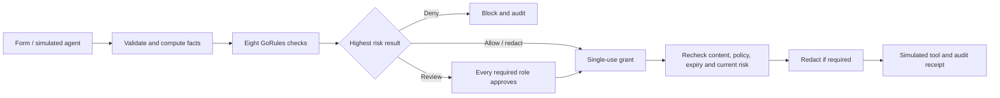

# AgentGate — AI action approvals

[English](README.en.md) · [简体中文](README.md)

An interactive GoRules demo that answers: **May an AI agent execute its next action?** It checks identity, permissions, data, destination, environment, volume, budget, content, and business context, then allows, redacts, requests human review, or blocks the action.

**8 check modules · 43 decision rules · 12 scenarios · 184 automated tests.**

Decisions run through the real `zen-engine==2.0.2`. No AI API key is required. Preset scenarios and editable forms simulate agent requests; all email, API, read, write, and delete operations return simulated receipts without touching real systems.

## Start the demo

With Python 3.9 or newer, run from this directory:

```bash
python3 -m venv .venv
source .venv/bin/activate
python -m pip install -r requirements.txt
python server.py
```

Open **http://127.0.0.1:8767/en/** for English, or **http://127.0.0.1:8767/** for Chinese. Use **English / 中文** in the top bar to switch languages. Switching reloads the page; saved requests and audit events remain, but unsaved form edits and in-memory grant tokens do not. Evaluate again to obtain a fresh grant.

On Windows, activate with `.venv\Scripts\activate`. On Mac, you can also run `./start.command`, which installs the dependency into an isolated environment on first use. Keep the server running while using the page.

Optional settings:

```bash
python server.py --port 8768 --db .demo-data/another-demo.sqlite
```

The server listens only on `127.0.0.1`. Local records are stored in `.demo-data/approval.sqlite`, which is excluded from Git.

## Five-minute walkthrough

### 1. Allow an action, then block a replay

1. Choose **Read public information**.
2. Click **Evaluate action** and inspect all eight checks.
3. Click **Simulate execution**.
4. Click **Try replay · should be blocked**. The single-use grant cannot execute twice.
5. Choose **Block secret leakage** and evaluate. The fake secret marker overrides the declared public classification and blocks the outbound action.

### 2. See actual redaction

1. Choose **Redact customer data** and click **Evaluate action**.
2. Click **Redact & simulate**.
3. The receipt shows `[EMAIL REDACTED]` and `[PHONE REDACTED]`, while the product quotation remains readable.

### 3. Require two reviewers

1. Choose **Security + finance review** and evaluate.
2. Click **Open review**. As the security reviewer, enter a note of at least five characters and approve.
3. Execution remains unavailable. Open review again and approve as the finance reviewer.
4. Once both roles approve, simulate execution or choose **Try changing the destination** to invalidate the grant.
5. Open **Audit timeline** to inspect the decisions, approvals, grants, and blocked attempts.

Reviewer identities are switchable demo personas. A requester cannot self-approve, finance cannot substitute for security, and repeating an approval does not satisfy another role.

### 4. Compare policy versions

1. Under v1, choose **Compare policy versions** and evaluate: 80 records are allowed.
2. Open **Policies**, select v2, and evaluate the same scenario again: more than 50 records require owner review.
3. Switching policies revokes all pending requests and unused grants. Switching back to v1 does not revive them.

### 5. Change the inputs

Adjust the environment, destination, classification, record count, cost, or payload. Evaluate again to see which checks change. Recent execution counts and cumulative costs come from server-side records. Thresholds are fictional demo policies.

## Decision and execution model



| Check | Examples |
|---|---|
| Identity & permissions | Disabled agent, tool scope, owner approval for deletion |
| Data classification | Upgrade classification from content; block secret egress; redact customer contacts |
| Destination trust | Internal `company.example`, trusted `partner.example`, unknown destinations, blocked `blocked.example` |
| Environment | Production writes need owner approval; production APIs need security approval; production deletion is denied |
| Action volume | Above 1,000 records is denied; 10 recent executions require review; 20 reach the hourly cap |
| Cost & budget | Above 100 credits requires finance; above 500 per action or 1,000 per hour is denied |
| Content & instructions | Payload size, empty emails, demo secret markers, limited suspicious phrases |
| Business purpose | Purpose length, production tickets, broad reads |

Each check uses a first-hit decision table and returns a rule code and explanation. The final priority is **deny > review > redact > allow**. Human approval cannot override denial. When review and redaction both apply, redaction still happens after approval.

A grant binds every normalized request field and the policy hash, including rule content. It expires five minutes after evaluation. Within one database transaction, execution rechecks current limits, consumes the grant, and records a simulated receipt. Concurrent replay cannot create a second receipt.

## Open the native GoRules decision graph

Import [rules/agent-approval.en.json](rules/agent-approval.en.json) into <https://editor.gorules.io/>. It contains 12 nodes: input, eight checks, risk aggregation, final decision, and output.

Paste one of these complete samples into **Simulator → Request**, then click **Run**:

- [Redacted email](samples/redact-mail.en.json): `outcome: "redact"`.
- [Security and finance review](samples/multi-review.en.json): `outcome: "review"`.
- [Secret leakage](samples/secret.en.json): `outcome: "deny"`.

The samples contain fixed facts for editor demonstrations. In the web app, the browser submits only the request and the server computes trusted facts. The editor evaluates the decision graph; the Python app implements approval, grants, expiry, persistence, and simulated execution.

## Tests and translation maintenance

From this directory with the environment activated:

```bash
python -m unittest discover -s tests -v
```

The 184 tests cover scenario outcomes under both policy versions, permissions, limits, malformed inputs, request binding, co-approval, expiry, policy changes, concurrent execution, audit integrity, HTTP origin checks, and English localization. English scenario and graph tests run the real GoRules engine.

Chinese and English share the same backend and UI behavior. English copy lives in [locales/en.json](locales/en.json). English assets, graphs, samples, and the discount fixture are generated from their shared sources:

```bash
python build_rules.py      # after changing decision rules
python build_english.py    # after changing rules, UI source, samples, or translations
python -m unittest discover -s tests -v
```

Edit `static/app.js` and `static/index.html`, then regenerate; do not edit `app.en.js` or `index.en.html` directly. Tests detect stale generated files and changed executable rules. API data, user-written request content, approval notes, and exported audit records remain verbatim. The UI translates system labels and explanations; English receipts display English redaction markers while retaining the original stored receipt and hash chain.

## Demo boundaries

This is a local single-operator demo, not a production security gateway. It has no real LLM, enterprise login, independent reviewer authentication, or external tool connections. Switching reviewer personas demonstrates role checks, not secure identity.

Content detection is limited to email addresses, Chinese mobile numbers, `sk_demo_` / `API_KEY=` / `password=` markers, and a small set of suspicious phrases. The audit hash chain detects accidental modification but has no external trust anchor. Rules load on server startup; restart after changing them.
