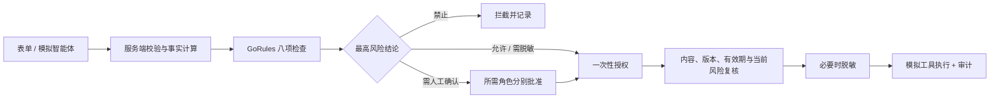

# AgentGate — AI 智能体操作审批台

一个可以实际操作的中文 GoRules Demo：AI 准备执行动作时，先检查身份、权限、数据、目标、环境、规模、预算和业务上下文，再决定允许、脱敏、人工审批或拦截。

**8 个检查模块 · 43 条决策规则 · 12 个场景 · 175 项自动化测试。**

规则由真实 `zen-engine==2.0.2` 执行。无需 AI API key；智能体申请由预设案例和表单模拟生成。邮件、接口、读写与删除均由模拟工具返回回执，不会操作真实系统。

## 最简单的启动方法

需要 Python 3.9 或更高版本。进入此目录后运行：

```bash
python3 -m venv .venv
source .venv/bin/activate
python -m pip install -r requirements.txt
python server.py
```

打开 **http://127.0.0.1:8767/**。关闭终端里的服务后网页将无法执行新操作。

Windows 将激活命令换成 `.venv\Scripts\activate`。Mac 也可在本目录运行 `./start.command`；首次启动会在独立虚拟环境安装依赖。

可选参数：

```bash
python server.py --port 8768 --db .demo-data/another-demo.sqlite
```

应用只监听本机 `127.0.0.1`。默认记录保存在 `.demo-data/approval.sqlite`，不会提交进 Git。刷新网页保留审计与申请；一次性授权原文仅保存在页面内存，刷新后需重新评估以取得新授权。

## 五分钟演示路线

### 1. 先看允许与拦截

1. 选择「读取公开资料」，点击「评估这次操作」。
2. 查看八项检查，点击「模拟执行这次操作」。
3. 点击「试试重复执行」，确认第二次被拦截。
4. 选择「密钥外发拦截」并评估：即使表单声明公开，模拟密钥标记也会提高实际数据分级并拦截。

### 2. 看真正的脱敏结果

1. 选择「客户资料脱敏外发」，点击评估。
2. 点击「脱敏并模拟执行」。
3. 在执行回执中查看 `[邮箱已脱敏]` 与 `[电话已脱敏]`；其他报价内容保留。

### 3. 体验多人审批

1. 选择「安全 + 财务会签」，点击评估。
2. 进入人工审批，以安全审核员填写至少五个字符的意见并批准。
3. 此时仍不能执行；重新进入审批，以财务审核员批准。
4. 两人都批准后，出现模拟执行按钮。
5. 可以正常执行，也可以点击「试试改目标后执行」，观察操作指纹不匹配使旧授权作废。
6. 进入「审计时间线」，查看决策、两次人工批准、授权签发和拦截。

审批窗口中的角色是可切换的**演示身份**；申请人不能自批，财务不能代替安全，重复批准不会充当第二个角色。

### 4. 比较规则版本

1. 在 v1 下运行「策略版本对比」：80 条记录可通过。
2. 去「规则与版本」切换 v2，再次评估相同案例：超过 50 条需负责人批准。
3. 切换版本会作废所有待审批与已授权但未执行的申请。切回 v1 也不会恢复旧授权。

### 5. 调整输入

修改环境、目标、数据级别、记录数、成本和内容，点击评估观察检查结果。频率与累计成本从本机执行记录计算，不接受浏览器传入的伪造统计。所有阈值是为演示设计的虚构政策。

## 决策与执行如何连接



- **身份与权限**：智能体停用、工具范围、删除审批。
- **数据分级**：声明与有限内容扫描合并；机密外发禁止；客户联系方式脱敏。
- **目标可信度**：内部 `company.example`、合作方 `partner.example`、未知目标与 `blocked.example` 禁止名单。
- **运行环境**：生产写入需批准，生产接口需安全确认，生产删除禁止。
- **操作规模**：单次超过 1,000 条禁止；近一小时 10 次起需安全复核，20 次起禁止。
- **成本与额度**：单次超过 100 演示点需财务批准，超过 500 禁止；近一小时累计超过 1,000 禁止。
- **内容与指令**：内容长度、空邮件、演示密钥标记与有限越权关键词。
- **业务理由**：理由长度、生产工单、大范围读取。

每个模块使用 first-hit 决策表，保留匹配规则代码和解释。最终结论优先级为 **禁止 > 人工审批 > 脱敏 > 允许**。人工审批不会覆盖禁止项；当人工审批与脱敏同时需要时，审批完成后仍进行脱敏。

授权绑定规范化后的**全部申请字段 + 规则版本和规则内容哈希**，从初次评估起五分钟有效。执行入口在同一数据库事务内复核累计限制、消费授权并写入模拟回执。同一申请只能产生一个回执；并发重复执行被拦截。

## 查看原生 GoRules 决策图

导入 [rules/agent-approval.json](rules/agent-approval.json) 到 <https://editor.gorules.io/>。这是一张 12 节点的 JDM 决策图（输入、八项检查、风险汇总、最终决策、输出）。

Simulator Request 可粘贴以下任一完整样例：

- [samples/redact-mail.json](samples/redact-mail.json)：预期 `outcome: "redact"`。
- [samples/multi-review.json](samples/multi-review.json)：预期 `outcome: "review"`，安全与财务检查要求人工确认。
- [samples/secret.json](samples/secret.json)：预期 `outcome: "deny"`。

这些样例的 `facts` 是固定模拟事实，仅供编辑器演示。在 Web 应用中，客户端只提交 `request`，可信事实由服务端生成。编辑器只运行决策图；审批、授权、计时、持久化与模拟执行由本示例的 Python 应用负责。

## 测试

在此目录、激活虚拟环境后：

```bash
python -m unittest discover -s tests -v
```

175 项测试覆盖双版本案例、权限矩阵、数据与目标组合、额度临界值、非法输入、所有字段的授权绑定、多人会签、过期、规则切换、并发消费、执行前累计风险复核、持久化、哈希链和 HTTP 接口来源检查。

测试直接运行真实 GoRules 引擎，没有另写一套 Python if/else 来冒充规则执行。规则由 [build_rules.py](build_rules.py) 生成；修改规则后执行 `python build_rules.py`，再运行测试。已有测试会检查生成内容与提交的 JDM 一致。

## 文件结构

| 文件 | 用途 |
|---|---|
| `approval.py` | 校验、可信事实、GoRules 调用、会签、授权、模拟执行和 SQLite |
| `build_rules.py` | 可审阅的八项决策表定义及 JDM 生成 |
| `rules/agent-approval.json` | 实际由引擎执行的决策图 |
| `server.py` | 本机 HTTP 服务、静态页面和 JSON API |
| `static/` | 中文表单、案例、审批、版本与审计界面 |
| `tests/test_approval.py` | 175 项测试 |
| `samples/` | 可粘贴到官方编辑器的固定输入 |

## 演示边界

这是本机单操作员演示，不是企业生产安全网关。没有真实 LLM、企业登录、外部工具连接或独立审批人身份验证。界面允许切换审批人是为了展示角色检查，不能作为生产身份凭据。

内容识别仅覆盖演示邮箱、国内手机号、`sk_demo_` / `API_KEY=` / `password=` 标记以及少量越权关键词；不提供完整敏感数据发现或提示注入检测。哈希链可检测记录意外变动，但没有外部可信锚点，不保证防管理员篡改。规则源文件在服务启动时加载，修改后需重启服务。

正常 API 支持申请、审批、执行、状态和策略切换。它不提供通用 HTTP 代理、Shell 执行、真实邮件发送或文件系统操作。
